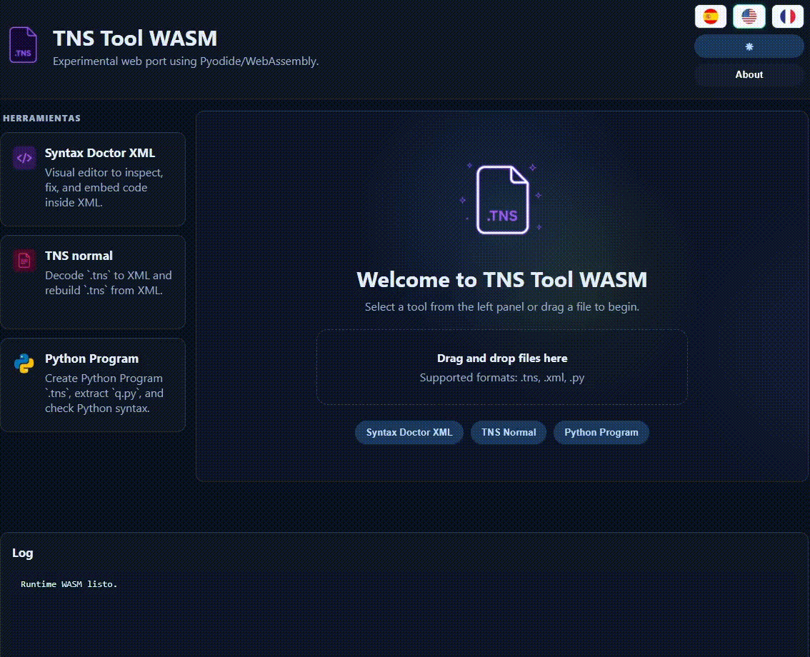
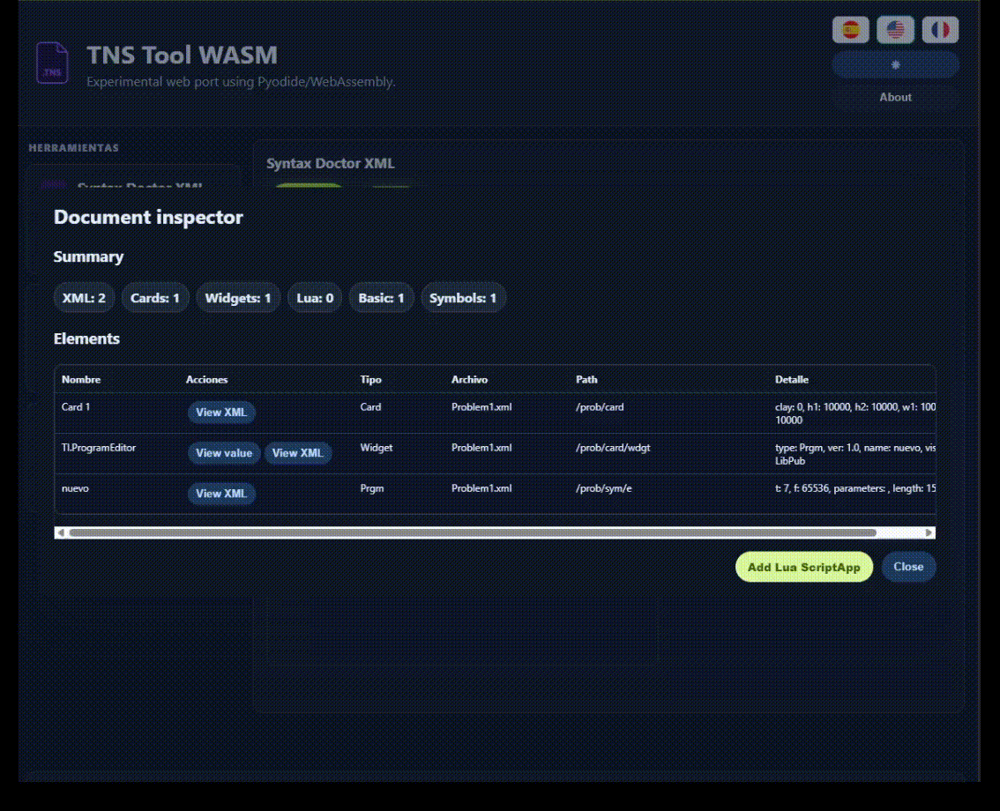
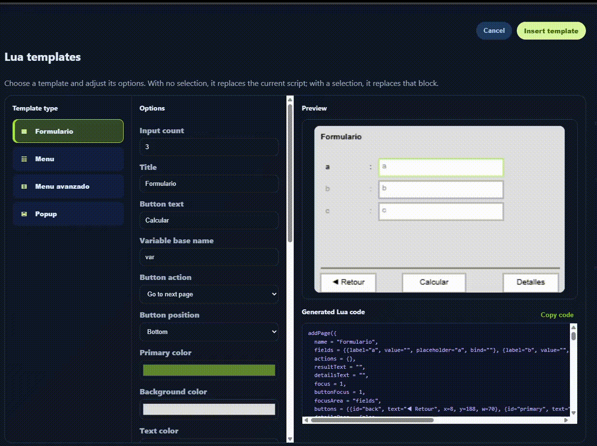
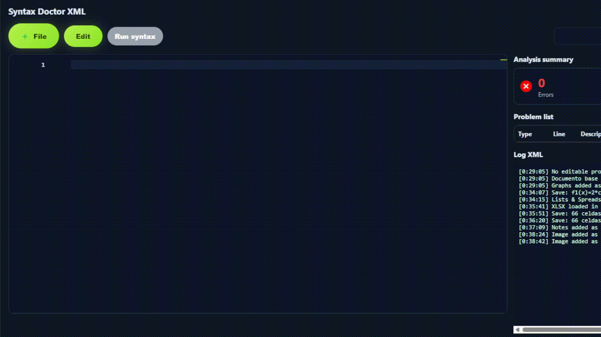
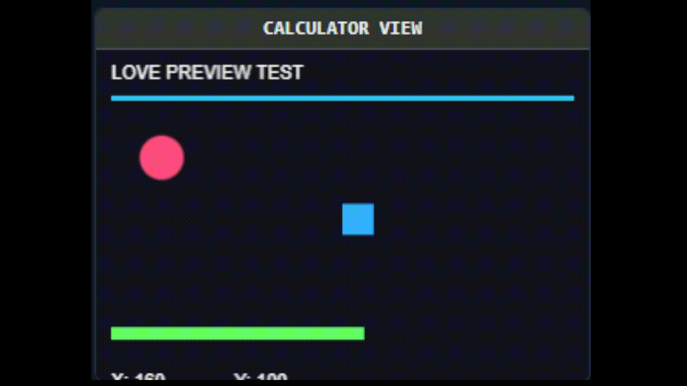
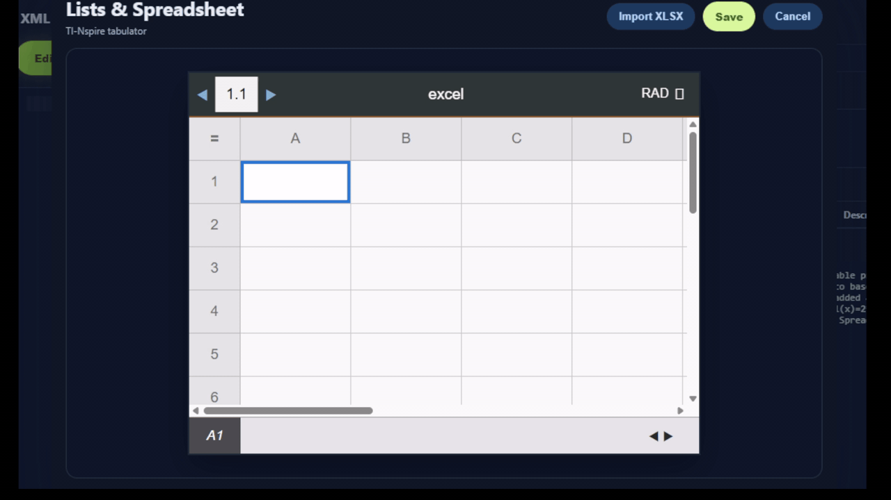
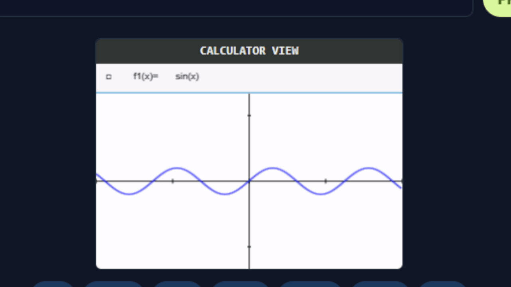

# TNS Tool WASM

TNS Tool WASM is an experimental browser-based toolkit for TI-Nspire workflows.

It runs directly in the browser with Pyodide/WebAssembly and JavaScript, so it can decode, inspect, edit, validate, and rebuild TI-Nspire-related files without requiring the original command-line workflow.

## Live Demo

https://acewalt.github.io/tns-tool-wasm/

## Video Demo

[Watch the demo on YouTube](https://youtu.be/ahgmAFpDRj8)

## What It Can Do

- Decode normal `.tns` files into editable XML folders.
- Rebuild normal `.tns` files from XML folders.
- Open `.xml`, `.tns.xml`, `.tns`, and ZIP-style project inputs through upload or drag and drop.
- Detect editable TI-Nspire program blocks inside XML.
- Edit, validate, and save TI-Nspire XML program code visually.
- Create Python Program `.tns` files from Python code and templates.
- Extract `q.py` from Python Program `.tns` files.
- Add and edit Lua ScriptApp pages inside TI-Nspire XML.
- Preview Lua ScriptApps in the browser with a TI-Nspire-like canvas.
- Insert visual Lua templates such as forms, menus, advanced menus, and popups.
- Edit generated Lua pages visually after inserting templates.
- Convert common TI-Basic/PRG menu-and-request programs into visual Lua pages.
- Run Lua ScriptApps programmatically from a Node CLI/API for agent-driven tests.
- Work in Spanish, English, and French.
  
 

## Syntax Doctor XML

Syntax Doctor XML is a visual editor for TI-Nspire XML program blocks.

It includes:

- Single XML file and `.tns.xml` folder loading.
- Editable program-block detection.
- Calculator-like code highlighting.
- Line, column, and issue reporting.
- Syntax diagnostics with errors, warnings, and information panels.
- Safe Auto Fix corrections.
- Manual variable resolution for ambiguous fixes.
- Preview of Auto Fix changes before saving.
- Formatting tools for spacing and empty-line cleanup.
- Save-back into XML.
- ZIP download of the edited XML project.


## Lua ScriptApp Tools

The Lua editor helps create and edit Lua ScriptApp code inside TI-Nspire XML.

It includes:

- Add Lua ScriptApp with a starter page.
- Lua syntax check.
- Browser-based Lua preview with keyboard buttons, click support, and input simulation.
- Lua guide panel.
- Lua template builder.
- Visual page editor.
- Save Lua back into XML.
- Richer code highlighting for Lua variables, keywords, strings, numbers, and comments.
- Page navigation helpers such as next, back, home, details, and direct page routing.

 

## Agent And CLI Lua Testing

TNS Tool WASM also exposes a programmatic Lua runner for agents and automated tests. It does not require browser clicks, DOM state, or the visual preview.

Examples:

```bash
npm install
npm test
npm run tns-tool -- capabilities --json
npm run tns-tool -- lua check archivo.lua --json
npm run tns-tool -- lua call archivo.lua --function miFuncion --args "[1,2]" --json
npm run tns-tool -- lua suite archivo.lua tests/edo.sample.json --json
npm run tns-tool -- lua preview archivo.lua --actions tests/preview.actions.json --json
npm run tns-tool -- tns create --output out/document.tns --json
npm run tns-tool -- tns add-lua out/document.tns archivo.lua --output out/with-lua.tns --json
```

The public JavaScript API is available from `src/api/index.js`:

```js
import { loadLuaScript, runLuaSuite } from "./src/api/index.js";

const lua = await loadLuaScript("archivo.lua");
const result = lua.call("miFuncion", [1, 2]);
console.log(result);
lua.close();
```

See [AGENTS.md](AGENTS.md) for the full machine-readable test format, preview actions, TNS commands, capabilities, exit codes, JSON output, schemas, and TI-Nspire mock limitations.

## Lua Templates

The template builder can generate reusable visual Lua pages.

 inspired by ProbasMaster, Formula Pro, and ABA Logique Nspire 2, were an experiment.

Available template families include:

- Formulario: calculator-style form with input fields, variable bindings, result output, details popup, and configurable buttons.
- Menu: simple vertical menu with route targets.
- Menu avanzado: TI-Nspire-style list menu with title, subtitle, scroll area, route targets, and optional back button.
- Popup: centered message box with configurable size, colors, text, and action.

Templates can be inserted into existing Lua code. Generated blocks include comments so users can see where each inserted template starts and ends.



## TI-Basic/PRG To Lua Visual Converter

The `TNS to Lua convert code` tool is experimental.

It is not a universal converter for every possible program or every programming language. It is a pattern-based converter focused on common TI-Basic/PRG structures:

- `Disp` menu screens.
- `Request` inputs.
- nested `If ... Then ... Else ... EndIf` routing.
- assignments using `→` or `->`.
- formulas using variables, arithmetic, powers, square roots, and common math functions.
- result/procedure text generated from nearby `Disp` lines.
- menu choices that set constants before opening the next form.

  

The goal is to convert many structured calculator programs into editable Lua visual pages, not to perfectly understand every possible TI-Basic program.

## Variable And Action System

Lua forms can bind input fields to variables. Buttons can run visual actions such as:

- calculate an expression.
- store the result in a variable.
- show result text.
- show procedure/details text.
- navigate to another page.
- use constants selected from previous menu choices.

This is useful for calculator-style workflows where one screen collects values, another screen routes options, and a details popup explains the calculation.

## Syntax Doctor PY

Syntax Doctor PY is a browser-based Python editor for Python Program workflows.

It includes:

- Python syntax checks through the shared Python analyzer.
- unsupported f-string detection.
- non-ASCII character detection.
- safe Auto Fix corrections.
- change preview.
- save edited code back into the inline Python block.
- `.py` download.
- TI-Nspire-inspired Python highlighting.

## Local Testing

From the repository root:

```powershell
python -m http.server 8000
```

Then open:

```text
http://localhost:8000/
```

Do not open `index.html` with `file://`, because browsers block the `fetch()` calls needed to load Python modules and runtime assets.

## Technical Notes

- Pyodide is loaded from the official CDN.
- JSZip is loaded from CDN for ZIP generation.
- Python modules are loaded into Pyodide at runtime.
- Lua preview runs through a LuaJS/Nspire-like runtime. The CLI/API can capture paint output as structured draw calls and visible text for agents.
- TNS CLI commands reuse the repository `tnstools.py` decode/build path through a Node/Python bridge.
- The browser cannot write directly to local Windows paths, so files are handled through upload and download.
- A fully offline version would need bundled Pyodide, JSZip, and runtime assets.

## Feedback

Bug reports, questions, suggestions, and test files are welcome.


## Current Page, Resource, And Preview Updates

Recent development has expanded TNS Tool WASM beyond program editing into a broader TI-Nspire document-building workflow.

### `+Page` system

A new `+Page` workflow can add pages directly to the current TI-Nspire document.

Current page types include:

- Program Editor
- Python
- Lua ScriptApp
- Lists & Spreadsheet
- Notes
- Graphs
- Images

`+Page` is available from the `File` menu and from `Document Inspector`.

If no document is open, `+Page` can create an empty base document automatically instead of forcing the user to create a default Program Editor document first.

`New document` and `Add Program Editor` remain separate operations:

- `New document` creates a new base Program Editor project.
- `Add Program Editor` adds another Program Editor card to the current document.

### Document Inspector improvements

`Document Inspector` can now identify and expose more TI-Nspire document elements, including:

- Cards
- Widgets
- Lua ScriptApps
- Program Editor
- Python
- Resources
- Images
- Lists & Spreadsheet
- Notes
- Graphs
- Symbols

Context-specific actions are shown when supported, such as:

- View XML
- View/Edit Lua
- View Image
- Open Sheet
- Open Notes
- Open Graph

The inspector and `+Page` menu were also adjusted for smaller/mobile layouts.

### Image resources and Add Image



`Add Image` can currently import:

- PNG
- JPG / JPEG
- BMP
- GIF

Imported images are converted into the TI-Nspire image-resource format used by the tested ScriptApp documents.

The current resource path is based on:

```text
source image
    ↓
browser canvas / RGBA
    ↓
RGB565 little-endian
    ↓
auxiliary 0xFF plane
    ↓
pageN.BMP
    ↓
TI ResourceHandle
    ↓
_R.IMG.img
    ↓
image.new(_R.IMG.img)
```

Multiple image cards use separate resources such as:

```text
page0.BMP
page1.BMP
page2.BMP
...
```

Image ScriptApps use API level `2.3` so `_R.IMG` resources are available.

### Image Viewer and Calculator View

The image viewer can decode and display the tested TI-Nspire resource format directly in the browser.

A `Calculator View` is also available to estimate how the resource will appear on the calculator.

For image ScriptApps, the preview uses the calculator-oriented viewport instead of simply fitting the full source image into the browser window. This makes it possible to inspect the approximate crop and visible area before rebuilding the TNS.

The tested calculator-oriented dimensions are approximately:

```text
320 × 240 total display
320 × 212 ScriptApp content area
```

The initial image view is handled at approximately 1:1 scale, matching the behavior observed in the reference image viewer documents.

### Preview LÖVE



`Preview LÖVE` has been expanded into a compatibility environment for both LÖVE-style Lua and TI-Nspire ScriptApps.

The goal is not to reproduce the full desktop LÖVE runtime. Instead, it provides enough compatibility to preview and test a growing subset of scripts directly in the browser.


Implemented or partially implemented areas include:

- `love.load`
- `love.update`
- `love.draw`
- `love.resize`
- keyboard and mouse callbacks
- drawing primitives
- text
- colors
- transforms
- Canvas
- Image / ImageData
- Quads
- Text objects
- SpriteBatch
- Mesh
- timer
- keyboard
- mouse
- virtual filesystem support
- math helpers
- TI-Nspire `platform`, `on.*`, `gc`, and image-resource compatibility

Some complex APIs still use safe shims or partial implementations rather than full native behavior.

Examples include:

- shaders
- advanced audio
- video
- physics
- threads
- joystick
- sensors

### Experimental LÖVE → TI-Nspire conversion

  

The project also includes an experimental conversion layer for turning some LÖVE-style Lua programs into TI-Nspire ScriptApps.

The generated compatibility layer maps supported LÖVE behavior to TI-Nspire-oriented APIs such as:

```text
platform
on.paint
on.timer
on.charIn
on.arrowKey
gc
```

The intended workflow is:

```text
LÖVE-style Lua
    ↓
compatibility conversion
    ↓
TI-Nspire Lua ScriptApp
    ↓
TNS
```

This is not a universal converter.

Programs that depend heavily on desktop-only features, external native libraries, advanced shaders, audio engines, physics, threads, or complex filesystem behavior may require manual changes or may not be compatible.

### Lists & Spreadsheet



Experimental `Lists & Spreadsheet` support has been added using the native `tabulator` widget structure.

The browser preview reproduces a calculator-style spreadsheet with:

- column labels
- row numbers
- selected cells
- formula/value display
- editable cells
- Save / Cancel workflow

Cell values are read from and written back to native TI-Nspire XML structures such as:

```xml
<tb:cell>
    <tb:rowId>1</tb:rowId>
    <tb:formula>111</tb:formula>
    <tb:data>111</tb:data>
</tb:cell>
```

This allows basic round-trip editing between the browser XML project and the calculator.

The spreadsheet preview also includes experimental `.xlsx` import for the first worksheet.

Current XLSX support is focused on basic cell data and simple formulas. Full Excel compatibility is not expected.

### Notes

`TI.Notepad` pages can now be detected, created, opened, edited, and saved from `Document Inspector`.

The Notes editor is intended to provide a lightweight calculator-style editing experience while preserving the native Notepad widget inside the document.

### Graphs


Experimental `TI.GeoGrapher` support has been added.

Graph pages can be created from `+Page`, detected in `Document Inspector`, and opened directly in `Preview LÖVE`.

The graph preview includes an editable function field such as:

```text
f1(x)=sin(x)
```

or:

```text
f1(x)=3*cos(2*x+π/2)+1
```

The preview draws the function on a calculator-style coordinate plane, and the formula can be edited or pasted directly before saving it back into the native Graphs XML structure.

Multiple graph pages can use function names such as:

```text
f1
f2
f3
...
```

Graph parsing and expression compatibility are still experimental and will continue to expand.

### Current limitations and planned work

The following features are not yet implemented or are still planned:

- PDF import into TNS documents
- batch / multi-select image import
- automatically creating one image card per selected image
- broader XLSX compatibility
- more TI-Nspire page/widget types
- more complete Graphs support
- a more complete mathematical expression parser
- broader LÖVE runtime coverage
- improved LÖVE → TI-Nspire conversion
- more accurate calculator previews where possible

A future batch-image workflow is expected to support a selection such as:

```text
image1.png
image2.jpg
image3.png
image4.bmp
```

and automatically generate:

```text
Card 1 → page0.BMP
Card 2 → page1.BMP
Card 3 → page2.BMP
Card 4 → page3.BMP
```

without requiring a separate `Add Image` operation for each file.


## Credits

Developed and implemented by Andres Mauricio Chaparro Pena.

Reverse-engineering packaging logic and base structure are attributed to MaksimirKurtov and the open TnsTools project:

- MaksimirKurtov: https://tiplanet.org/forum/memberlist.php?mode=viewprofile&u=393033
- TnsTools: https://tiplanet.org/forum/viewtopic.php?t=27393&p=280845#p280845

The original idea and technical mentoring for the WebAssembly/Web port are attributed to Adriweb:

- Adriweb: https://tiplanet.org/forum/memberlist.php?mode=viewprofile&u=1381

## Disclaimer

TNS Tool WASM is an independent software-development project and is not affiliated with, sponsored by, authorized by, or officially associated with Texas Instruments.
